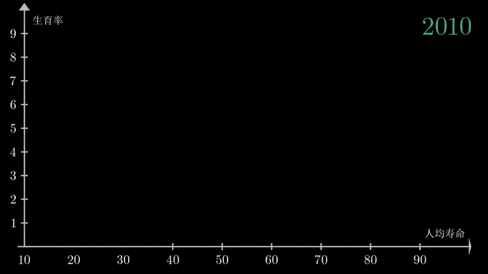

# Danim

Animation Tools for Data visualization, based on Manim of 3blue1brown

This is Data Animation Tool that creates gif or mp4 video of animated data.

A tool that let your data talk!

Here are some achieved features of this tools: (will add more in the future)


### 1.Bubble chart animation:

Animate the bubble chart, the effects is as follows：
this gif may load for a while...


*DATA source: gapminder & UN

In bubble chart animation, you can have personalized settings:

(1) The Creation settings:

there are three options in creation: 

directly showing everything(option 1)


Show each bubble, but its color is given randomly(option 2)


Show each bubble by its color group(option 3)


Change the creation settings in BubbleChartAnimation.py: Line 4

```sh
class BubbleChartAnimation(Scene):
    def construct(self):
        self.AllContriesComparison()
```
to

```sh
class BubbleChartAnimation(Scene):
    def construct(self):
        self.AllContriesComparison(start_option = "3")
```
default is option 2


(2) hight light option:
if in the middle of progression, you want to stop and hightlight some bubbles,
you can choose to use Get_Hightlight_Animation() method,
detailed code is in line 142 of BubbleChartAnimation.py


You can achieve this function by unannotate the code in Line 142-155 in BubbleChartAnimation.py

### 2.Distribution chart animation:
You can have multiple choices:

Show the distribution

See how it changes through time

Stack different distributions together

the effects is as follows： 
again... please be patient, this gif may load for a while...


*DATA source: gapminder & UN

### 3.A lot more to come.... 
There are many ideas that I'm currently developing, 

3b1b/manim is really a very powerful tool.

Feel free to contact me if you have any good ideas, welcome to contribute!


# Installation

Danim is based on Python and manim,

so you need to install python3.7 and 3b1b/manim

The installation guide for 3b1b/manim is at (https://github.com/3b1b/manim)

System requirements are [cairo](https://www.cairographics.org), [ffmpeg](https://www.ffmpeg.org), [sox](http://sox.sourceforge.net), [latex](https://www.latex-project.org) (optional, if you want to use LaTeX).

Once you have done manim installation, download the danim file and release the file in the "Danim" folder to the manim.

Go to the manim folder and run the following code

```sh
python -m manim Danim/BubbleChart/BubbleChartAnimation.py BubbleChartAnimation -p
```

you will have your first Bubble Chart Video created.


### Customize your own bubble chart animation:

You can change the data in DATA/X.csv and DATA/Y.csv and DATA/R.csv 

You can change the axes settings in BubbleChart/bubble_constants.py
